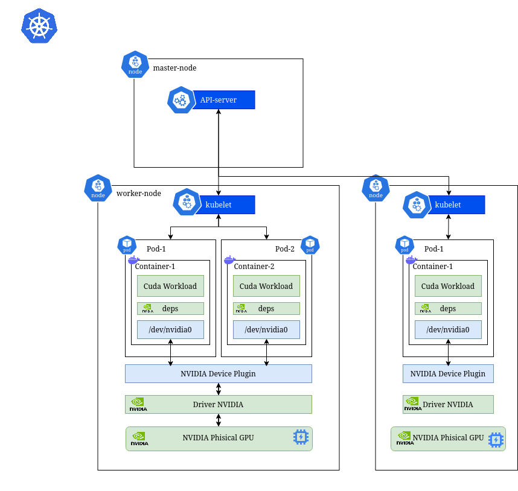

<div align="center">

# KRATOS

**Framework for Application-Aware GPU Scheduling in Kubernetes**

[](https://kubernetes.io/)
[](https://go.dev/)
[](https://www.nvidia.com/)
[](https://prometheus.io/)
[](https://opensource.org/licenses/Apache-2.0)

</div>

KRATOS is a Kubernetes operator for studying application-aware
GPU scheduling of CUDA workloads on heterogeneous clusters.

The framework does not replace Kubernetes or Volcano. It adds an **intermediate
decision layer** that learns from previous executions, scores eligible nodes, and
generates scheduling hints.

The current design goal is to let users describe **CUDA workloads** together with
their scheduling requirements, such as GPU memory, compute capability, priority,
replica count, and distributed constraints. 

After an initial execution, the controller is expected to collect **profiling information** from *nsight-compute*
(e.g. if a kernel is compute-bound or memory-bound) and reuse that profile to score nodes
for later runs, in order to make the scheduling policy application-aware.

## Status

Planned integrations include:

- Kubernetes for resource **lifecycle management**.
- NVIDIA Nsight Compute and DCGM for CUDA **profiling** and GPU metrics.
- Prometheus and Grafana for runtime **observability**.

## Architecture



## Getting Started

Clone the repository and run the local test suite:

```bash
git clone git@github.com:chirichexe/kratos.git
cd kratos
make test
```

The `make test` target generates Kubernetes manifests, regenerates deepcopy
code, runs formatting and vet checks, downloads envtest binaries, and then runs
the Go tests.

Install the CRD into the Kubernetes cluster selected by your current
`kubectl` context:

```bash
make install
```

Run the controller locally against that cluster:

```bash
make run
```

In another terminal, create a sample CUDA workload:

```bash
kubectl apply -f config/samples/gpu_v1alpha1_cudaexperiment.yaml
kubectl get cudaexperiments.gpu.scheduler.io
```

For a local GPU-enabled Kubernetes lab, see
[Local GPU Lab](docs/getting-started/kind-gpu.md).

## CUDAExperiment

Users describe a CUDA workload with one Kubernetes custom resource:

```yaml
apiVersion: gpu.scheduler.io/v1alpha1
kind: CUDAExperiment
metadata:
  name: cuda-vector-add
spec:
  image: nvcr.io/nvidia/k8s/cuda-sample:vectoradd-cuda12.5.0
  command: ["./vectorAdd"]
  replicas: 1
  gpuRequired: 1
  minimumComputeCapability: "7.0"
  minimumMemory: 4Gi
  priority: normal
  profilingEnabled: true
  distributed: false
  numberOfGPUs: 1
  numberOfNodes: 1
```

The operator is responsible for profile lookup, cluster scoring, node-selection
hints, Volcano submission, and profile updates after execution.

## Development

Run the package tests:

```bash
make test
```

Regenerate Kubernetes assets after API or RBAC changes:

```bash
make manifests
make generate
```

## Documentation

- [Published documentation](https://chirichexe.github.io/kratos/)
- [Project structure](docs/development/project-layout.md)
- [Getting started](docs/getting-started/README.md)
- [Architecture](docs/architecture/README.md)
- [Operator lifecycle](docs/operator/README.md)
- [Experiment notes](docs/experiments/README.md)

## License

KRATOS is licensed under the [Apache License 2.0](LICENSE).
