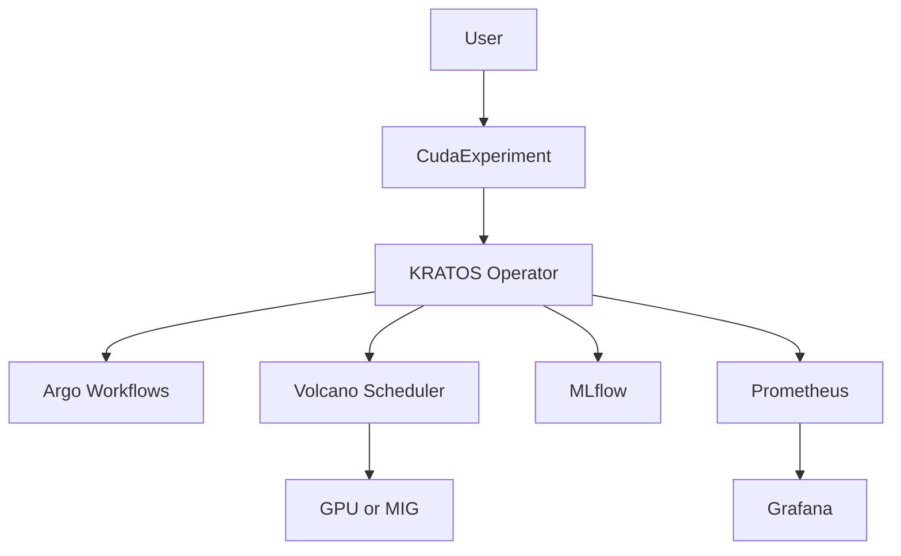

# Architecture

KRATOS is planned around five layers:

1. Users submit `CudaExperiment` resources.
2. The operator creates profiling, workflow, scheduling, metadata, and metrics
   resources.
3. Volcano schedules workloads onto GPU or MIG capacity.
4. Nsight tooling profiles unknown CUDA workloads.
5. Prometheus, Grafana, and DCGM Exporter expose metrics.

The research hypothesis is that CUDA microarchitectural data can improve GPU
allocation, throughput, fairness, and makespan compared with policies based
only on declared resource requests.
