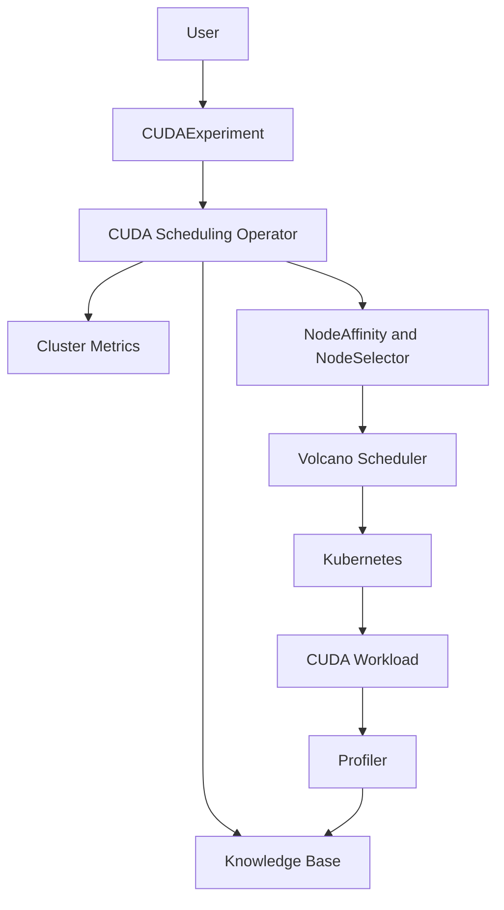

# Architecture

KRATOS is planned around five components:

1. Kubernetes manages resource lifecycle.
2. Volcano remains the final scheduler.
3. The CUDA Scheduling Operator evaluates workload history and cluster state.
4. The knowledge base stores workload profiles.
5. The profiler collects CUDA metrics after execution.

The operator applies hard constraints first, then scores eligible nodes using
compute, memory, network, load, energy, and heterogeneity signals. Volcano still
performs the final scheduling decision.
