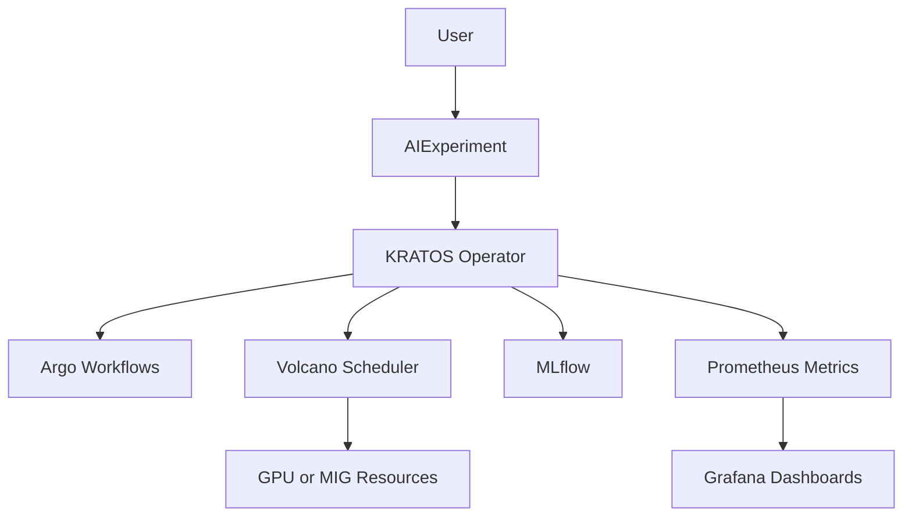
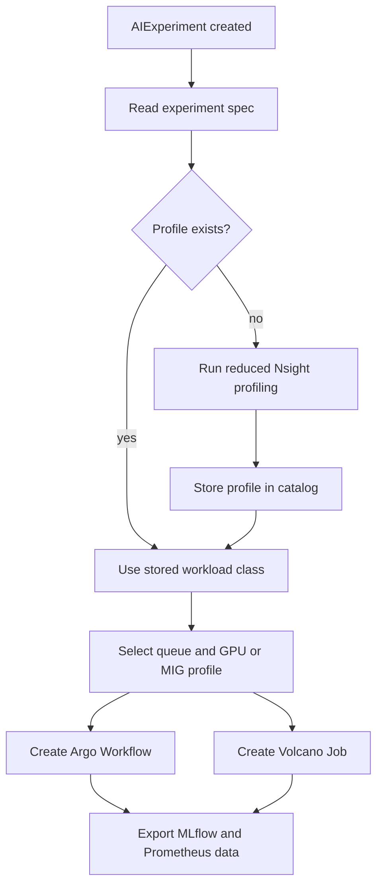
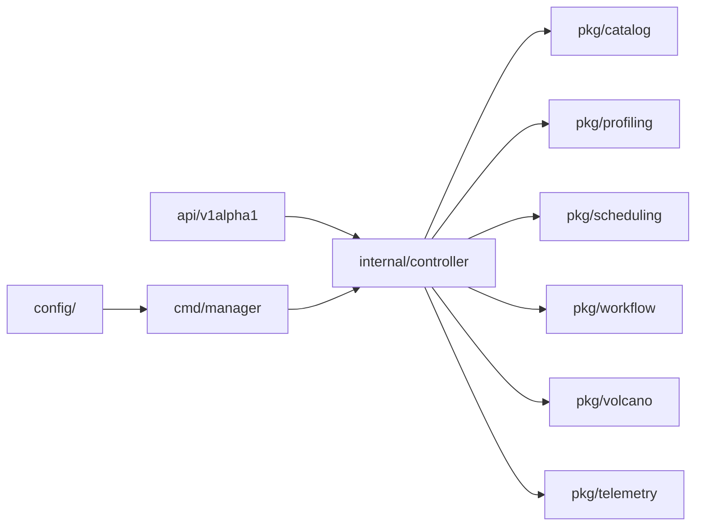

# KRATOS Architecture

KRATOS is organized into five layers:

1. User layer: users submit only `AIExperiment` resources.
2. Orchestration layer: the KRATOS operator creates Argo Workflows, Volcano
   Jobs, MLflow metadata, GPU requests, and monitoring labels.
3. Scheduling layer: Volcano schedules the workload using queues and policies
   selected by KRATOS.
4. Profiling layer: Nsight Compute and Nsight Systems characterize unknown CUDA
   workloads through short profiling runs.
5. Monitoring layer: Prometheus, Grafana, and NVIDIA DCGM Exporter expose
   infrastructure and architectural metrics.

## Reconciliation Flow

When an `AIExperiment` is created, the controller follows a small decision loop:

## Module Map

The codebase separates Kubernetes controller code from the domain modules used
by the reconciler:

The experimental hypothesis is that CUDA microarchitectural information can
improve GPU allocation, throughput, fairness, and makespan compared with
policies based only on declared resource requests.
